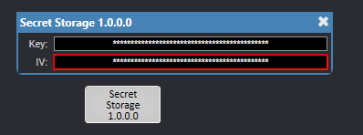

# Secrets
## Tools

- OpenSSL (comes pre-installed with most Linux distributions)
	- [Windows](https://adamtheautomator.com/openssl-windows-10/)
- AES-256-CBC (Advanced Encryption Standard with Cipher Block Chaining mode) as the encryption algorithm
- A random initialization vector (IV) for each encryption operation
- Use the provided Secret Storage plugin and cipher_gen user component

## Encryption

1. Generate a random key:
```
openssl rand -base64 32 > key.txt
```

2. Generate random IV:
```
openssl rand -base64 32 > IV.txt
```

3. Put the key and IV in the Secret Storage Plugin
	1. Plugin provided in `plugins/secret-storage.qplug`
	2. It is also a part of `user-components/qobserve-x.x.x.quc`



4. Generate cipher in Q-SYS Lua
	1. User component provided in `user-components/cipher_gen.quc`
	2. Put your secret (e.g API key) as the value for the plain variable
```lua
SS = Component.New("SecretStorage")

plain = "plainText"

key = Crypto.Base64Decode(SS["SecretStorage.text.1"].String)
iv = Crypto.Base64Decode(SS["SecretStorage.text.2"].String)

cipher = Crypto.Base64Encode(Crypto.Encrypt(Crypto.Cipher.AES_256_CBC, key, iv, plain))
print(cipher)

decrypted = Crypto.Decrypt(Crypto.Cipher.AES_256_CBC ,key, iv, Crypto.Base64Decode(cipher))
print(decrypted)
```

```
9scr7nUoQKy66UGEnecG3Q==
plainText
```

5. Put the encoded cipher in `src/secrets.json`
```json
{
"splunkToken": "9scr7nUoQKy66UGEnecG3Q==",
...
}
```

6. Repeat for any other secrets
7. Clear terminal and erase plain variable

```lua
plain = ""
```